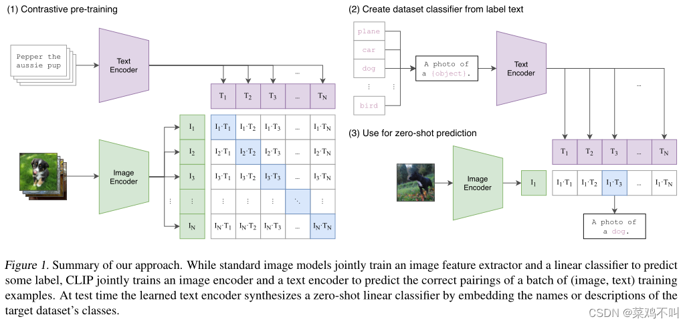

# CLIP
Paper：Learning Transferable Visual Models From Natural Language Supervision

Affiliation: OpenAI

Publication：ICML-2021

Code: https://github.com/OpenAI/CLIP

## 前言
CLIP（ Contrastive Language–Image Pre-training）基于对比学习的语言-图像预训练）建立在**零样本迁移**（zero-shot transfer）、自然语言监督学习( natural language supervision,) 和多模态学习方面的大量工作之上。
CLIP是一个预训练模型，训练好的模型能实现，输入一段文本（或者一张图像），输出文本（图像）的向量表示。CLIP和BERT、GPT、ViT的区别在于，CLIP是多模态的，包含图像处理以及文本处理两个方面内容，而BERT、GPT是单文本模态的，ViT是单图像模态的。

CLIP惊艳之处在于架构非常简洁且效果好到难以置信，在zero-shot文本-图像检索，zero-shot图像分类，open-domain 检测分割等任务上均有非常惊艳的表现。

### 动机
原始文本中预训练模型，在 NLP 领域中产生了革命性的成功。但是在 CV 等其它领域，一般的做法还是在 ImageNet 这种数据集上去训练一个模型，这样会使训练好的模型有诸多限制。那么 **NLP 里的这套框架是否能用在 CV 里呢**？

### 相关工作
CLIP 与 Learning Visual N-Grams from Web Data （2017年）的工作比较相似，都做了 zero-shot 的迁移学习，但当时 Transformer 还未提出，也没有大规模的且质量较好的数据集，因此17年的这篇论文的效果并不是很好。有了 Transformer、对比学习、”完形填空“ 等强大的自监督训练方式后，也有一些工作尝试把图片和文本结合起来，去学得更好的特征，如 VirTex，ICMLM，ConVIRT，这些工作与 CLIP 很相似，但也有所区别，VirTex使用自回归的预测方式做模型的预训练；ICMLM使用 ”完形填空“ 的方法做预训练；ConVIRT 与 CLIP 很相似，但只在医学影像上做了实验。这三种方法都没有在模型或数据集上使用很大的规模。

## 方法
CLIP 方法的核心就是**用自然语言的监督信号来训练一个比较好的视觉模型**。

思路：为什么要用自然语言的监督信号来训练视觉模型？

**不需要再去标注这些数据了。**像 ImageNet 需要先定好 1000 个类，而这 1000 各类也需要之前筛选选好，根据这些类去下载图片，再清理数据集，然后标注，这个过程比较复杂。如果只需要下载 图片-文本 对，别的标注都不需要做，那么数据的规模很容易就变大，而且现在的监督信号是一个文本，而不是这种 N 选 1 的标签，模型的输入输出自由度就大了很多。
因为训练时把图片和文本绑定到一起，那么训练的特征就不再仅是一个视觉特征了，而是一个多模态的特征，也就很容易去做 zero-shot 的迁移学习。如果只是做单模态的自监督学习，无论是单模态的对比学习（如MOCO），还是单模态的掩码学习（如MAE），都只能学到视觉特征，而无法与自然语言联系到一起，这样还是很难做 zero-shot 迁移。


- 多模态预训练的监督学习任务包括：跨模态掩码，跨模态匹配，条件文本生成（Captioning）
- 跨模态掩码又包括语言掩码建模，视觉掩码建模
- 跨模态匹配又包括图像文本匹配，图像文本对比学习（CLIP使用）

### 模型结构

如图所示，CLIP的主要结构是一个文本编码器Text Encoder和一个图像编码器Image Encoder，然后计算文本向量和图像向量的相似度来预测他们是否是一对。

如图所示，CLIP共有3个阶段        

- Contrastive pre-training：预训练阶段，使用图片 - 文本对进行对比学习训练；
- Create dataset classifier from label text：提取预测类别文本特征;
- Use for zero-shot predictiion：进行 Zero-Shot 推理预测;

CLIP将图像和文本先分别输入一个图像编码器（image encoder）和一个文本编码器 （text encoder）,得到图像和文本的向量表示I-f 和 T_f。然后将图像和文本向量表示映射到一个联合的多模态空间（joint multimodal space），得到新的可直接进行比较的图像和文本向量表示I_e 和T_e（这是多模态学习中常见的一种方法，不同模态数据表示之间可能存在gap），无法进行直接的比较，因此计算图像和文本向量之间的cosine相似度。最后，对比学习的目标函数就是让正样本对的相似度较高，负样本对的相似度比较低。

#### 预训练
在预训练阶段，对比学习中正样本对和负样本的定义为能够配对的图片-文本对，和不能匹配的图片-文本对。具体来说，先分别对图像和文本提特征，这时图像对应生成 I1、I2 ... In 的特征向量，文本对应生成 T1、T2 ... Tn 的特征向量，然后中间对角线为正样本，其余均为负样本。这样的话就形成了 n 个正样本，n^2 - n 个负样本，有了正负样本，模型就可以通过对比学习的方式训练起来了，完全不需要手工的标注。当然，自监督的训练需要大量的数据，OPEN AI 的这个训练数据量大约在 4亿个的数量级，数据来源均来自于互联网。
目标函数就是让正样本对的相似度较高，负样本对的相似度比较低

#### 提取预测类别文本
由于CLIP 预训练时候的文本端输出输入的是个词，但原始的类别都是句子，因此首先需要对文本类别进行一些单词转句子的处理，如法如下：使用 A photo of a {object}. 的提示模板 (prompt template) 进行构造，比如对于 dog，就构造成 A photo of a dog.，然后再送入 Text Encoder 进行特征提取，这样就会得到一个文本的特征向量。

#### 推理预测
模型推理比较简单，只需要将输入图片传给ImagesEncoder模块，就会生成一个一维的图片特征向量，然后拿这个图片特征和 第二阶段生成的文本特征做余弦相似度对比，最相似的即为我们想要的那个结果，比如这里应该会得到 A photo of a dog. 


## Code
```python

class VisionTransformer(nn.Module):
    def __init__(self, input_resolution: int, patch_size: int, width: int, layers: int, heads: int, output_dim: int):
        super().__init__()
        self.input_resolution = input_resolution
        self.output_dim = output_dim
        self.conv1 = nn.Conv2d(in_channels=3, out_channels=width, kernel_size=patch_size, stride=patch_size, bias=False)

        scale = width ** -0.5
        self.class_embedding = nn.Parameter(scale * torch.randn(width))
        self.positional_embedding = nn.Parameter(scale * torch.randn((input_resolution // patch_size) ** 2 + 1, width))
        self.ln_pre = LayerNorm(width)

        self.transformer = Transformer(width, layers, heads)

        self.ln_post = LayerNorm(width)
        self.proj = nn.Parameter(scale * torch.randn(width, output_dim))

    def forward(self, x: torch.Tensor):
        # x: 输入原始图像，经过缩放，统一的大小为 224*224
        
        # 一幅输入224 x 224的图像，首先经过卷积处理得到16 x 16个patch，那么每一个patch的大小就是14 x 14
        # 将每一个patch的矩阵拉伸成为一个1维向量，从而获得了近似词向量堆叠的效果。上一步得道的14 x 14的patch就转换为长度为196的向量
        x = self.conv1(x)  # shape = [*, width, grid, grid]
        
        # 每个patch拉伸为1*196
        x = x.reshape(x.shape[0], x.shape[1], -1)  # shape = [*, width, grid ** 2]
        x = x.permute(0, 2, 1)  # shape = [*, grid ** 2, width]
        
        # 加上class embedding变为1*197的向量
        # class_embedding主要借鉴了BERT模型的用于文本分类时的思想，在每一个word vector之前增加一个类别值，通常是加在向量的第一位,上一步得到的196维的向量加上class_embedding后变为197维。
        # 增加的class_embedding是一个可以学习的参数，经过网络的不断训练，最终以输出向量的第一个维度的输出来决定最后的输出类别；由于输入是16 x 16个patch，所以输出进行分类时是取 16 x 16个class_embedding进行分类。
        x = torch.cat([self.class_embedding.to(x.dtype) + torch.zeros(x.shape[0], 1, x.shape[-1], dtype=x.dtype, device=x.device), x], dim=1)  # shape = [*, grid ** 2 + 1, width]
        
        # 加上1*197的position embedding
        # pos_embedding也是一组可以学习的参数，会被加入到经过处理的patch矩阵中
        # 它的加入类似于全链接网络和卷积的bias
        x = x + self.positional_embedding.to(x.dtype)
        
        # pre layer norm
        x = self.ln_pre(x)

        x = x.permute(1, 0, 2)  # NLD -> LND
        x = self.transformer(x)
        x = x.permute(1, 0, 2)  # LND -> NLD
        
        # post layer norm
        x = self.ln_post(x[:, 0, :])
        # 由于增加的class_embedding是一个可以学习的参数，经过网络的不断训练
        # 最终以输出向量的第一个维度的输出来决定最后的输出类别
        # [bs, n_patch=257, dim=1024] -> [bs, dim=1024]      

        if self.proj is not None:
            x = x @ self.proj

        return x

class CLIP(nn.Module):
    def __init__(self,
                 embed_dim: int,
                 # vision
                 image_resolution: int,
                 vision_layers: Union[Tuple[int, int, int, int], int],
                 vision_width: int,
                 vision_patch_size: int,
                 # text
                 context_length: int,
                 vocab_size: int,
                 transformer_width: int,
                 transformer_heads: int,
                 transformer_layers: int
                 ):
        super().__init__()

        self.context_length = context_length

        if isinstance(vision_layers, (tuple, list)):
            vision_heads = vision_width * 32 // 64
            self.visual = ModifiedResNet(
                layers=vision_layers,
                output_dim=embed_dim,
                heads=vision_heads,
                input_resolution=image_resolution,
                width=vision_width
            )
        else:
            vision_heads = vision_width // 64
            self.visual = VisionTransformer(
                input_resolution=image_resolution,
                patch_size=vision_patch_size,
                width=vision_width,
                layers=vision_layers,
                heads=vision_heads,
                output_dim=embed_dim
            )

        self.transformer = Transformer(
            width=transformer_width,
            layers=transformer_layers,
            heads=transformer_heads,
            attn_mask=self.build_attention_mask()
        )

        self.vocab_size = vocab_size
        self.token_embedding = nn.Embedding(vocab_size, transformer_width)
        self.positional_embedding = nn.Parameter(torch.empty(self.context_length, transformer_width))
        self.ln_final = LayerNorm(transformer_width)

        self.text_projection = nn.Parameter(torch.empty(transformer_width, embed_dim))
        self.logit_scale = nn.Parameter(torch.ones([]) * np.log(1 / 0.07))

        self.initialize_parameters()

    def encode_image(self, image):
        return self.visual(image.type(self.dtype))

    def encode_text(self, text):
        x = self.token_embedding(text).type(self.dtype)  # [batch_size, n_ctx, d_model]

        x = x + self.positional_embedding.type(self.dtype)
        x = x.permute(1, 0, 2)  # NLD -> LND
        x = self.transformer(x)
        x = x.permute(1, 0, 2)  # LND -> NLD
        x = self.ln_final(x).type(self.dtype)

        # x.shape = [batch_size, n_ctx, transformer.width]
        # take features from the eot embedding (eot_token is the highest number in each sequence)
        x = x[torch.arange(x.shape[0]), text.argmax(dim=-1)] @ self.text_projection

        return x

    def forward(self, image, text):
        image_features = self.encode_image(image)
        text_features = self.encode_text(text)

        # normalized features
        image_features = image_features / image_features.norm(dim=1, keepdim=True)
        text_features = text_features / text_features.norm(dim=1, keepdim=True)

        # cosine similarity as logits
        logit_scale = self.logit_scale.exp()
        logits_per_image = logit_scale * image_features @ text_features.t()
        logits_per_text = logits_per_image.t()

        # shape = [global_batch_size, global_batch_size]
        return logits_per_image, logits_per_text

```

## 附录

### Zero-shot
零样本迁移（Zero-shot Transfer）是指模型在没有见过目标任务任何标注数据的情况下，通过学习到的通用知识和语义关系，直接完成目标任务。这种能力依赖于模型在预训练阶段学习到的泛化能力，使其能够在新的场景或任务中灵活应用。
核心思想：零样本迁移的核心在于，模型在**预训练阶段学会了不同类别之间的语义关联和知识，使得在没有见过某个特定类别的数据的情况下，仍然可以通过这些已知的关联来识别新类别**。
与迁移学习的区别：
虽然零样本学习是迁移学习的一个特殊场景，但它们之间存在重要区别。迁移学习需要在目标任务上有一部分训练数据，而零样本学习则完全不需要。
举例说明：
假设一个模型已经学会了识别“马”、“老虎”、“熊猫”等动物，现在需要它识别“斑马”。零样本迁移是指，在不给模型展示任何“斑马”图片的情况下，通过描述“斑马”与已学习过的动物之间的关系，让模型能够识别出“斑马”。
应用场景：
零样本学习在自然语言处理、图像识别、语音识别等领域都有广泛应用，尤其是在标注数据稀缺或难以获取的情况下，零样本学习能够帮助模型快速适应新的任务和场景。
总结：
零样本迁移是一种利用模型预训练阶段习得的泛化能力，实现无监督新任务识别的技术。它在没有目标任务标注数据的情况下，通过知识迁移完成任务，具有重要的实际应用价值。
