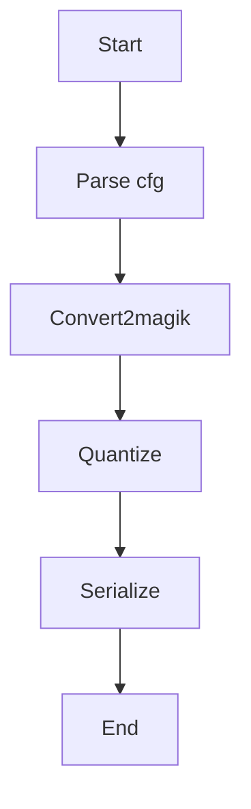

## 流程



```c++
int main(int argc, char** argv) {
    // Parse magik config
    MagikConfig& magik_config = create_magik_config(argc, argv);

    // Convert
    GraphDef* magik_graph = magik_converter(&magik_config);

    // Quantize
    GraphDef* quantize_magik_graph = quantize_graph(magik_graph, &magik_config);

    // Serialize
    serialize(quantize_magik_graph, &magik_config);

    return 1;
}
```

### Parse cfg

### Convert model 2 target model

```c++
GraphDef* magik_converter(MagikConfig* cfg) {
    // Converter
    // onnx2magik magik_model(protobuf)
    GraphDef* magik_graph = create_magik_graph(cfg);

    // Post convert optimizer
    // 计算无关优化（如：无用与不可达代码消除，常量传播、常量折叠，公共子表达式消除）
    post_convert_optimize_execute(magik_graph, cfg);

    return magik_graph;
}
```

#### 计算无关优化
图结构优化
- AppendInputOutputNOpOptimizer：优化图的输入输出节点，确保它们符合特定格式或要求。
- ClipModelByNOpOptimizer：根据配置的节点数量限制裁剪模型。
- CheckSubGraphOptimizer：检查子图结构，确保子图的完整性和正确性。
- InsertPostProcessesOptimizer：在图中插入后处理节点，完成模型输出的后处理。
- RemoveUselessOpAroundMatMulOptimizer：移除矩阵乘法节点周围的无用节点，提高计算效率。
- RemoveSpecifiedOpTypeOptimizer：根据指定的算子类型列表移除无用节点，减少计算开销。
- MoveConstInputOptimizer：将常量输入节点移动到更合适的位置，优化图结构。
- DynamicPadFusionOptimizer：融合动态填充节点，减少冗余操作。
- ConvertSplitToSliceOptimizer：将分割操作转换为切片操作，提高执行效率。
- SplitGCNWeightOptimizer：拆分图卷积网络的权重节点，优化权重的使用方式。
- ConvTransposeSeparationOptimizer：分离转置卷积节点，提高计算效率。
- SplitConvGemmAndBiasAddOptimizer：分离卷积、矩阵乘法和偏置加法节点，优化计算流程。
ConvExpandDimOptimizer：扩展卷积节点的维度，使其符合特定要求。
TensorConvertOptimizer：转换张量节点的格式或类型，确保数据的一致性。
ConvertUpsampleTypeOptimizer：转换上采样节点的类型，提高兼容性和性能。
ConvertOnnxResizeTypeOptimizer：转换 ONNX 中的 Resize 节点类型，优化上采样或下采样操作。
ConvertNegToMulOptimizer：将负数乘法节点转换为乘法节点，提高计算效率。
ConvertClipToActivateOptimizer：将裁剪节点转换为激活节点，优化激活函数的实现。
ConvertExpandToUpsampleOptimizer：将扩展节点转换为上采样节点，提高上采样操作的性能。
TransposeGruInputOptimizer：转置 GRU 输入节点，使其符合 GRU 的输入要求。
TransposeLstmInputOptimizer：转置 LSTM 输入节点，使其符合 LSTM 的输入要求。
TransposeLstmIOOptimizer：转置 LSTM 的输入和输出节点，优化 LSTM 的数据流。
DilateConv2DRecognitionOptimizer：识别并优化二维扩张卷积节点，提高计算效率。
RemoveUselessOpAroundSoftmaxOptimizer：移除 Softmax 节点周围的无用节点，优化分类任务的执行效率。
ChannelShuffleRecognitionOptimizer：识别并优化通道混洗节点，提高通道混洗操作的性能。
GRURecognitionOptimizer：识别并优化 GRU 节点，提高 GRU 的执行效率。
HardSigmoidRecognitionOptimizer：识别并优化硬 sigmoid 节点，提高激活函数的性能。
HardSwishRecognitionOptimizer：识别并优化硬 Swish 节点，优化激活函数。
PadFusionOptimizer：融合填充节点，减少冗余的填充操作。
ConvertAddToBiasAddOptimizer：将加法节点转换为偏置加法节点，提高计算效率。
LayerNormalizationRecognitionOptimizer：识别并优化层归一化节点，提高层归一化的执行效率。
BatchNormRecognitionOptimizer：识别并优化批量归一化节点，提高批量归一化的性能。
CheckBatchNormInputsOptimizer：检查批量归一化节点的输入节点，确保输入的正确性。
ConvsConcatSeparationOptimizer：分离卷积和拼接节点，优化特征图的拼接操作。
SharedWeightBiasSeparationOptimizer：分离共享权重和偏置节点，提高权重和偏置的管理效率。
ConcatBypassOptimizer：优化拼接节点的旁路连接，减少不必要的计算。
BiasAddFusionOptimizer：融合偏置加法节点，提高计算效率。
BatchNormFusionOptimizer：融合批量归一化节点，提高批量归一化的性能。
ActivateFusionOptimizer：融合激活函数节点，提高激活函数的执行效率。
AttentionRecognitionOptimizer：识别并优化注意力机制节点，提高注意力机制的性能。
AdjacentTransposeFusionOptimizer：融合相邻的转置节点，减少冗余的转置操作。
RemoveRedundantNodesOptimizer：移除图中的冗余节点，简化图结构。
GruMergeOptimizer：合并 GRU 节点，提高 GRU 的执行效率。
FreezeModelOptimizer：冻结模型，将模型转换为推理模式，提高推理性能。

### Quantize

#### PTQ


### QAT
```c++
GraphDef* magik_training_quantization(GraphDef* graph, MagikConfig* cfg) {
    // step1: training quantize optimizer
    transform_model(graph, {"specialized_convolution_generator"});
    shape_inference_process(graph, cfg);
    save_magikproto_to_pb(__func__, __LINE__, *graph);

    graph_transforms::remove_nodes_by_name(graph, cfg->get_config_model().get_remove_names());
    save_magikproto_to_pb(__func__, __LINE__, *graph);

    std::vector<std::string> nodes_name = cfg->get_config_model().get_update_info_names();
    if (nodes_name.size() >=0){
        std::vector<ShapeT> nodes_update_shape_info = cfg->get_config_model().get_update_shape_info();
        updata_node_shape(graph, nodes_name, nodes_update_shape_info);
    }
    
    save_magikproto_to_pb(__func__, __LINE__, *graph);

    TransformFuncContext context;
    context.params.insert({KQUANTIZE_DEVICES, {cfg->get_config_arch().get_soc_name()}});
    transform_model(graph,
                    {"fuse_convolution_quantize_operators", "fuse_embeddings", "fuse_rnns", "fuse_matmuls",
                     "fuse_binary_ops", "fuse_quantize_ops", "rename_quantified_op"},
                    context);
    save_magikproto_to_pb(__func__, __LINE__, *graph);

    // step2: quantize parameter inference
    // 形状推断(OP output_shape)和参数推理(onnx没提供，但后面需要的)
    quantize_parameter_inference_process(graph);
    save_magikproto_to_pb(__func__, __LINE__, *graph);

    // step3: magik training quantize
    // 这里主要是量化npool2D, Upsample(bilinear)2ResizeBilinear,其他OP没什么操作
    AwareTrainingQuantize quantize_engine;
    GraphDef* quantize_graph = new GraphDef;
    quantize_engine.load_graphs(graph, quantize_graph);
    quantize_engine.quantify_graph();

    save_magikproto_to_pb(__func__, __LINE__, *quantize_graph);
    return quantize_graph;
}
```

### Serialize

以下是对你提供的 C++ 代码的逐行解析和功能说明：

---

#### **函数概述**
```cpp
void SerialInterface::_serial_T40(const GraphDef* graph)
```
- **功能**：将输入的计算图（`GraphDef`）转换为适合 T40 硬件加速器的串行化模型。
- **参数**：
  - `graph`: 输入的原始图（不可变）。
- **流程**：通过一系列图变换和优化，生成最终可被硬件执行的图结构。

---

#### **代码解析**

##### **1. 初始化与拓扑排序**
```cpp
std::vector<std::string> node_need_drop = {"Flatten", "FlattenInt8"};
GraphDef* venus_graph = new GraphDef();

graph_transforms::sort_by_execution_order(*graph, venus_graph);  // topo sort
save_magikproto_to_pb("t40_compare", __LINE__, *venus_graph, for_internal());
```
- **目的**：
  - 创建新图 `venus_graph` 并复制原图的拓扑排序（Topological Sort），确保节点按执行顺序排列。
  - 保存中间结果用于调试（`save_magikproto_to_pb`）。
- **关键操作**：
  - 删除 `Flatten` 和 `FlattenInt8` 节点（后续会移除）。

---

#### **2. 图变换与优化**
###### **(1) 删除冗余节点**
```cpp
t40::GraphTransform::delete_reshape_before_matmul(venus_graph, node_name_map);
t40::GraphTransform::delete_reshape_or_squeeze_after_lstmv2(venus_graph, node_name_map);
save_magikproto_to_pb("delete_reshape_or_squeeze", __LINE__, *venus_graph);
```
- **目的**：移除矩阵乘法前的 `Reshape` 或 LSTM 后的 `Squeeze` 操作，简化图结构。

###### **(2) 维度转换**
```cpp
graph_transforms::Graph3dimTo4dim graph_3dim_to_4dim;
graph_3dim_to_4dim(venus_graph, node_name_map);
save_magikproto_to_pb("graph_3dim_to_4dim", __LINE__, *venus_graph);
```
- **目的**：将 3D 张量（如 `[N, H, W]`）转换为 4D 张量（如 `[N, 1, H, W]`），适配硬件要求。

###### **(3) 节点重命名与属性添加**
```cpp
t40::rename_t40_nodes(venus_graph, node_name_map);  // ptq model add is_input attr
save_magikproto_to_pb("rename_t40_nodes", __LINE__, *venus_graph);
```
- **目的**：为量化模型（PTQ）添加 `is_input` 属性，并统一节点命名规范。

###### **(4) 移除指定节点**
```cpp
graph_transforms::remove_nodes(venus_graph, node_need_drop);
save_magikproto_to_pb("remove_nodes", __LINE__, *venus_graph);
```
- **目的**：删除 `Flatten` 和 `FlattenInt8` 节点（已标记为冗余）。

---

##### **3. 核心图融合与优化**
```cpp
graph_transforms::transform_model(venus_graph, {
    "fuse_quantize_conv2d_serial",
    "fuse_convint8_serial", 
    "set_is_output_attribute"
});
```
- **目的**：执行以下融合规则：
  - 将量化卷积（Quantized Conv2D）与后续操作融合。
  - 设置输出节点属性（`is_output`）。

---

##### **4. 首层节点预处理**
```cpp
t40::set_first_layer_fill_channel(venus_graph, node_name_map);
t40::graph_first_layer_preprocess(venus_graph, node_name_map, cfg_);
save_magikproto_to_pb("graph_first_layer_preprocess", __LINE__, *venus_graph);
```
- **目的**：
  - 填充首层通道（如调整输入通道数以满足硬件对齐要求）。
  - 执行首层特有预处理（如插值、填充）。

---

##### **5. 插入后处理模块**
```cpp
InsertPostProcessesOptimizer insert_post_process_optimizer(...);
insert_post_process_optimizer.post_process_insertor(venus_graph);
```
- **目的**：根据配置插入后处理操作（如归一化、裁剪）。

---

##### **6. 分块处理**
```cpp
bool split_block_tag = false;
split_block_tag = run_split_block(venus_graph, cfg_, split_block_tag);
save_magikproto_to_pb("block_reproduction", __LINE__, *venus_graph, for_internal());
```
- **目的**：根据配置决定是否将大图拆分为多个小块（`split_block`），适应硬件内存限制。

---

##### **7. 图简化与对齐**
```cpp
t40::GraphSimplifier graph_simplifier;
GraphDef* simplify_graph = graph_simplifier(venus_graph);
save_magikproto_to_pb("simplified", __LINE__, *simplify_graph);
delete simplify_graph;

t40::GraphIcOcAligner graph_ic_oc_aligner;
graph_ic_oc_aligner(venus_graph, node_name_map);
save_magikproto_to_pb("graph_ic_oc_aligner", __LINE__, *venus_graph);
```
- **目的**：
  - 简化图结构（如合并常量、消除冗余节点）。
  - 对齐输入/输出通道（`IC/OC`）以满足硬件对齐要求。

---

##### **8. 插入 Pad 节点**
```cpp
t40::GraphTransform::add_padint8_nodes(venus_graph, node_name_map);
save_magikproto_to_pb("add_pad_node", __LINE__, *venus_graph);
```
- **目的**：为低精度量化（INT8）操作添加填充节点，确保张量尺寸对齐。

---

##### **9. 移除冗余节点**
```cpp
graph_transform.drop_concat_node(venus_graph, node_name_map);
save_magikproto_to_pb("serial_drop_concat", __LINE__, *venus_graph);

graph_transforms::drop_unused_node(venus_graph);
save_magikproto_to_pb("drop_unused_node", __LINE__, *venus_graph);
```
- **目的**：移除无用的 `Concat` 节点和未使用的节点，进一步精简图。

---

##### **10. 添加节点属性**
```cpp
t40::NodeProtoAdder node_proto_adder;
node_proto_adder(venus_graph, node_name_map, cfg_);
save_magikproto_to_pb("proto_compare", __LINE__, *venus_graph, for_internal());
```
- **目的**：为节点添加硬件相关的属性（如数据类型、内存布局）。

---

##### **11. 条件分支：多卷积融合**
```cpp
if (!split_block_tag) {
    // 多阶段卷积融合规则
    graph_transforms::transform_model(venus_graph, {"merge_pws1dws1pws1conv_add_int8", ...});
    save_magikproto_to_pb("merge_conv_add_int8", __LINE__, *venus_graph);
}
```
- **目的**：若未分块，则执行更激进的卷积融合策略（如 `1x1 + 3x3 + 1x1` 卷积链合并为单个操作）。

---

##### **12. 最终处理与序列化**
```cpp
graph_transform.rename_output_fmtcvt_node(venus_graph, node_name_map);
save_magikproto_to_pb("rename_output_fmtcvt", __LINE__, *venus_graph);

t40::GraphResConvert graph_res_converter;
graph_res_converter(venus_graph, node_name_map);
save_magikproto_to_pb("graph_res_converter", __LINE__, *venus_graph);

common::SerialGraphSort serial_graph_sort;
serial_graph_sort(venus_graph);

graph_transform.add_tag(venus_graph, node_name_map);
save_magikproto_to_pb("add_tag", __LINE__, *venus_graph, for_internal());

t40::T40Serializer serializer(cfg_);
serializer(venus_graph, node_name_map);
delete venus_graph;
```
- **目的**：
  - 重命名输出格式转换节点（`fmtcvt`）。
  - 调整资源分配（`GraphResConvert`）。
  - 排序图节点（`SerialGraphSort`）。
  - 添加标签（`add_tag`）。
  - 使用 `T40Serializer` 序列化最终图到目标硬件格式。

---

#### **关键设计模式**
1. **责任链模式**：
   - 每个 `graph_transforms::*` 或 `t40::GraphTransform::*` 方法独立完成一个具体任务，形成流水线式处理。
2. **模板方法模式**：
   - `_serial_T40` 定义了整体流程，但具体实现由子类或静态方法提供。
3. **策略模式**：
   - 根据 `split_block_tag` 的值选择不同的融合策略。

---

#### **注意事项**
1. **内存管理**：
   - 使用 `new GraphDef()` 动态分配 `venus_graph`，需确保在末尾 `delete` 释放。
   - 中间生成的 `simplify_graph` 也需显式 `delete`。
2. **调试支持**：
   - `save_magikproto_to_pb` 频繁调用，便于跟踪每一步的图变化。
3. **硬件适配**：
   - 所有变换均针对 T40 芯片特性（如通道对齐、INT8 支持）。

---

#### **总结**
该函数的核心目标是通过一系列图变换和优化，将通用计算图转换为适合 T40 硬件加速器的串行化模型。关键步骤包括：
- **拓扑排序** → **节点删除** → **维度转换** → **属性添加** → **算子融合** → **资源对齐** → **序列化输出**。

最终输出的是一个经过深度优化、适配硬件特性的图结构，能够高效运行在 T40 芯片上。

```c++
void SerialInterface::_serial_T40(const GraphDef* graph) {
    std::vector<std::string> node_need_drop = {"Flatten", "FlattenInt8"};
    GraphDef* venus_graph = new GraphDef();

    graph_transforms::sort_by_execution_order(*graph, venus_graph);  // topo sort
    save_magikproto_to_pb("t40_compare", __LINE__, *venus_graph, for_internal());

    common::NodeNameMap& node_name_map = common::NodeNameMap::get_instence();

    t40::GraphTransform::delete_reshape_before_matmul(venus_graph, node_name_map);
    t40::GraphTransform::delete_reshape_or_squeeze_after_lstmv2(venus_graph, node_name_map);
    save_magikproto_to_pb("delete_reshape_or_squeeze", __LINE__, *venus_graph);

    graph_transforms::Graph3dimTo4dim graph_3dim_to_4dim;
    graph_3dim_to_4dim(venus_graph, node_name_map);
    save_magikproto_to_pb("graph_3dim_to_4dim", __LINE__, *venus_graph);

    t40::rename_t40_nodes(venus_graph, node_name_map);  // ptq model add is_input attr
    save_magikproto_to_pb("rename_t40_nodes", __LINE__, *venus_graph);

    graph_transforms::remove_nodes(venus_graph, node_need_drop);
    save_magikproto_to_pb("remove_nodes", __LINE__, *venus_graph);

    graph_transforms::transform_model(venus_graph, {"fuse_quantize_conv2d_serial",
                                                    "fuse_convint8_serial", "set_is_output_attribute"});

    t40::set_first_layer_fill_channel(venus_graph, node_name_map);
    t40::graph_first_layer_preprocess(venus_graph, node_name_map, cfg_);
    save_magikproto_to_pb("graph_first_layer_preprocess", __LINE__, *venus_graph);

    InsertPostProcessesOptimizer insert_post_process_optimizer(cfg_->config_model().config_post_processes(), 1, 1);
    insert_post_process_optimizer.post_process_insertor(venus_graph);

    bool split_block_tag = false;
    split_block_tag = run_split_block(venus_graph, cfg_, split_block_tag);
    save_magikproto_to_pb("block_reproduction", __LINE__, *venus_graph, for_internal());

    t40::GraphTransform graph_transform;
    graph_transform(venus_graph, node_name_map);

    t40::GraphSimplifier graph_simplifier;
    GraphDef* simplify_graph = graph_simplifier(venus_graph);
    save_magikproto_to_pb("simplified", __LINE__, *simplify_graph);
    delete simplify_graph;

    t40::GraphIcOcAligner graph_ic_oc_aligner;
    graph_ic_oc_aligner(venus_graph, node_name_map);
    save_magikproto_to_pb("graph_ic_oc_aligner", __LINE__, *venus_graph);

    t40::GraphTransform::add_padint8_nodes(venus_graph, node_name_map);
    save_magikproto_to_pb("add_pad_node", __LINE__, *venus_graph);

    graph_transform.drop_concat_node(venus_graph, node_name_map);
    save_magikproto_to_pb("serial_drop_concat", __LINE__, *venus_graph);

    graph_transforms::drop_unused_node(venus_graph);
    save_magikproto_to_pb("drop_unused_node", __LINE__, *venus_graph);

    t40::NodeProtoAdder node_proto_adder;
    node_proto_adder(venus_graph, node_name_map, cfg_);
    save_magikproto_to_pb("proto_compare", __LINE__, *venus_graph, for_internal());

    if (!split_block_tag) {
        graph_transforms::transform_model(venus_graph, {"merge_pws1dws1pws1conv_add_int8", "merge_pws1dwsxpws1conv_int8", "merge_pws1dwsxconv_int8"});
        save_magikproto_to_pb("merge_pws1dwsxconv_int8", __LINE__, *venus_graph);

        graph_transforms::transform_model(
            venus_graph, {"merge_k33s2pwpwk33s1addnnapwpw","merge_k33s2pwk33s1conv_add_int8", "merge_k33sxk33s1k33sxconv_add_int8",
                    "merge_three_conv_add_int8", "merge_three_conv_add_int8_4bit", "merge_k33s1k33s1conv_add_int8",
                    "merge_pwk33s1conv_add_int8", "merge_conv_maxpool_int8_4bit", "merge_conv_maxpool_int8",
                    "merge_conv_add_int8", /*"merge_k33conv_add_int8",*/ "merge_conv_add_int8_4bit",
                    "merge_AddPW_int8", "merge_k33s1_Add_int8", "merge_gru_matmul_fqat"});  //,"merge_up_k44s1k11s1conv_add_int8"});

        save_magikproto_to_pb("merge_conv_add_int8", __LINE__, *venus_graph);

        graph_transform.merge_four_conv2d_to_mergeconv(venus_graph, node_name_map);
        save_magikproto_to_pb("serial_merge_four_conv2d_to_mergeconv", __LINE__, *venus_graph);

        graph_transforms::transform_model(venus_graph,{"merge_pwpwconv_4bit"});
        save_magikproto_to_pb("merge_pwpwconv_4bit", __LINE__, *venus_graph);
    }

    graph_transform.rename_output_fmtcvt_node(venus_graph, node_name_map);
    save_magikproto_to_pb("rename_output_fmtcvt", __LINE__, *venus_graph);

    t40::GraphResConvert graph_res_converter;
    graph_res_converter(venus_graph, node_name_map);
    save_magikproto_to_pb("graph_res_converter", __LINE__, *venus_graph);

    common::SerialGraphSort serial_graph_sort;
    serial_graph_sort(venus_graph);

    graph_transform.add_tag(venus_graph, node_name_map);
    save_magikproto_to_pb("add_tag", __LINE__, *venus_graph, for_internal());

    t40::T40Serializer serializer(cfg_);
    serializer(venus_graph, node_name_map);
    delete venus_graph;
}
```
